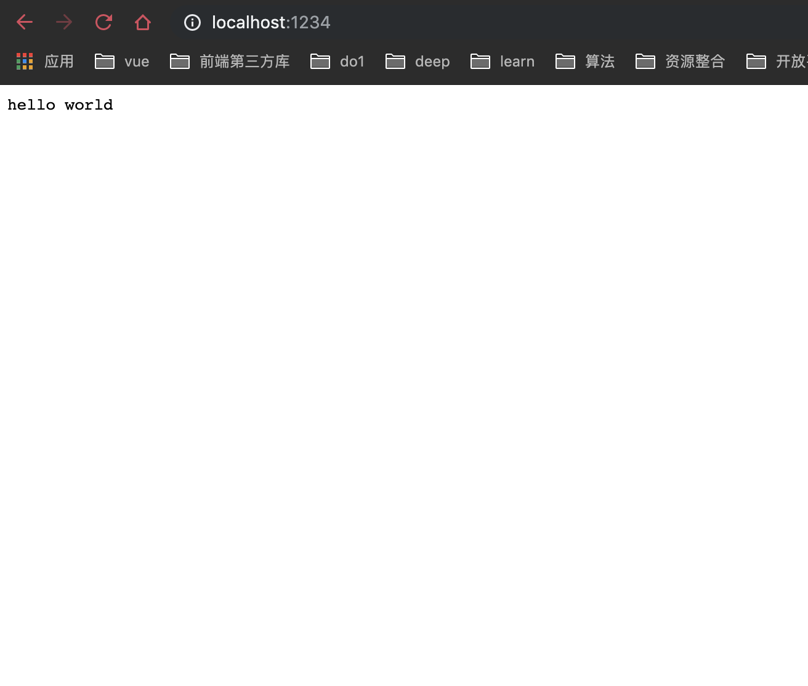

### 服务器初始化

#### 1. 创建项目
```shell
mkdir server  # 创建服务器代码文件夹
cd server   # 进入
npm init -y # 初始化npm配置文件
```

#### 2. 安装koa基础包

```bash
yarn add koa koa-bodyparser koa-router
```


#### 3. hello world实例

1. 创建程序主要入口代码
```bash
touch app.js
```

2. 编写helloworld 程序

```javascript
// /server/app.js
const Koa = require('koa')

const app = new Koa()

// 中间件
app.use(async (ctx, body) => {
  ctx.body = 'hello world'
})

app.listen(1234, () => {
  console.log(`服务器已启动....`)
})

```

3. 运行程序
```
node app.js
```
4. 查看效果
打开[http://localhost:1234](http://localhost:1234)



## 结束